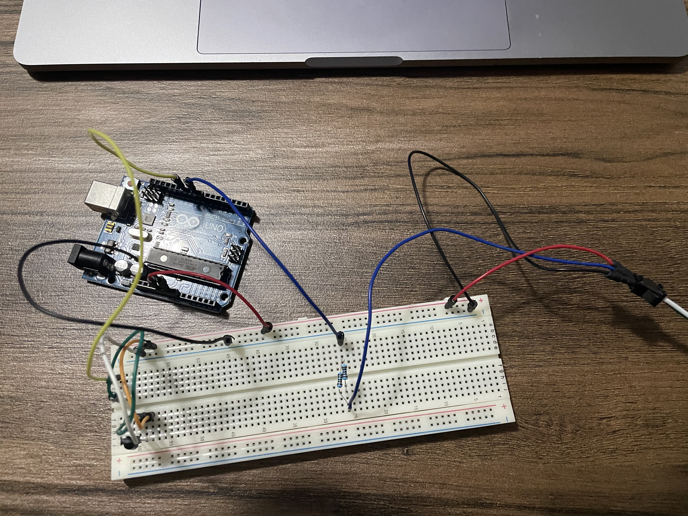
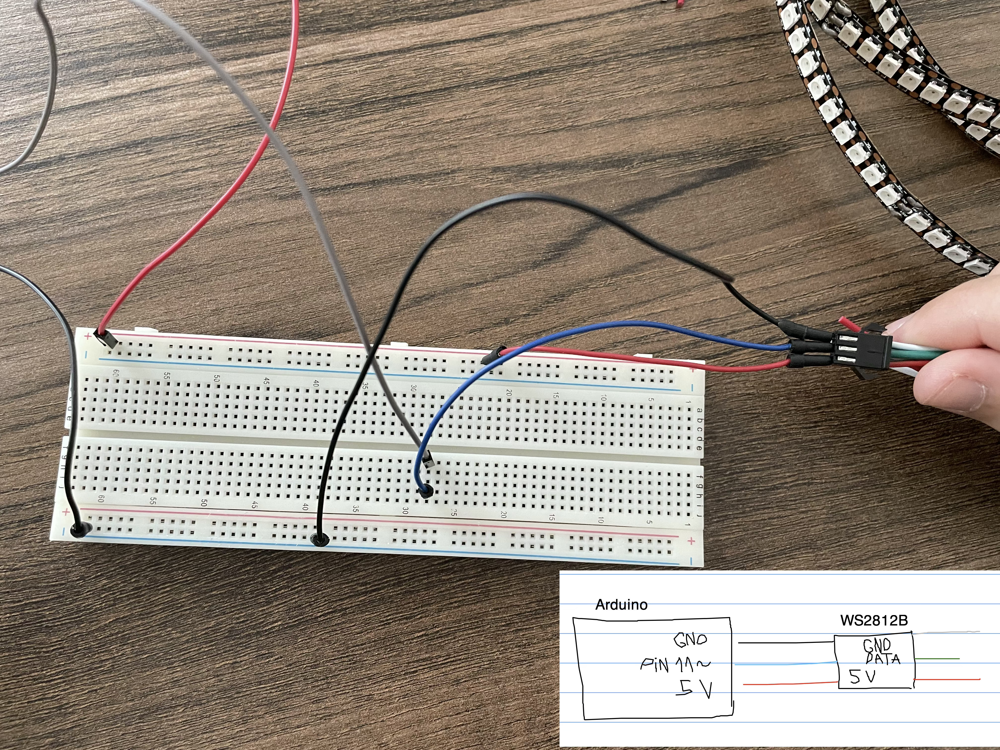
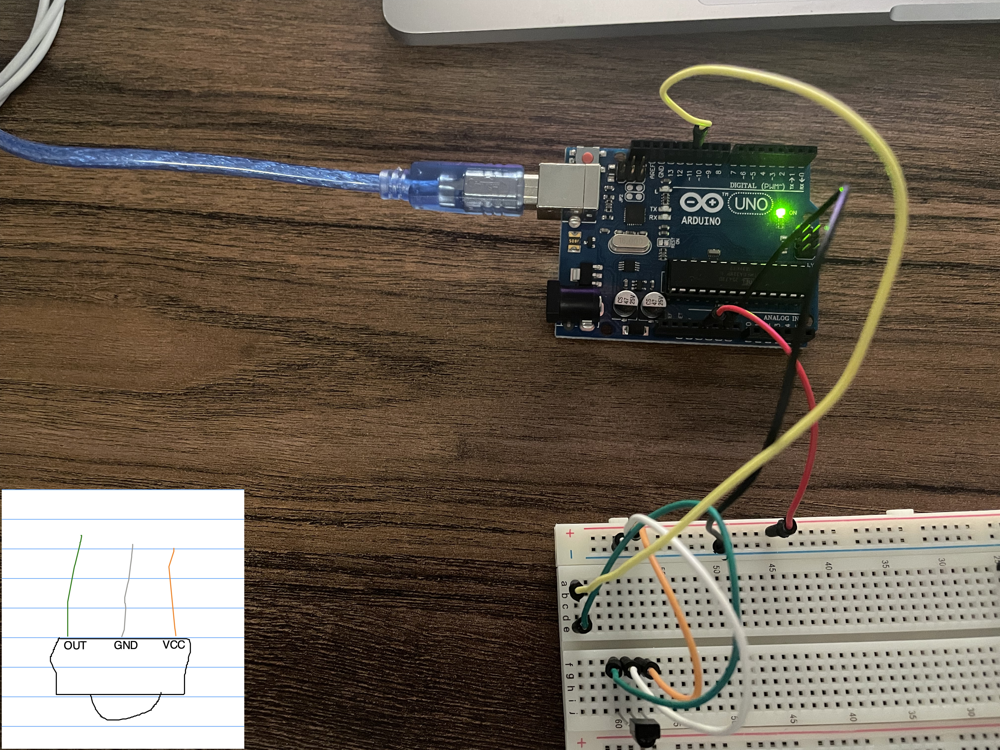
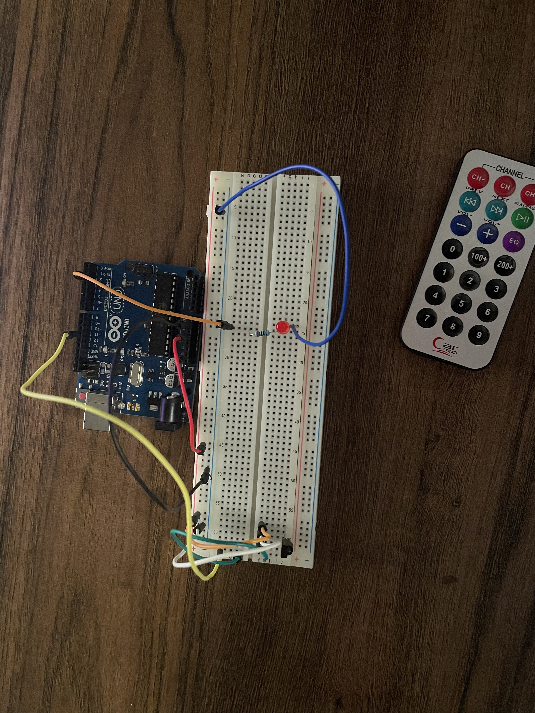
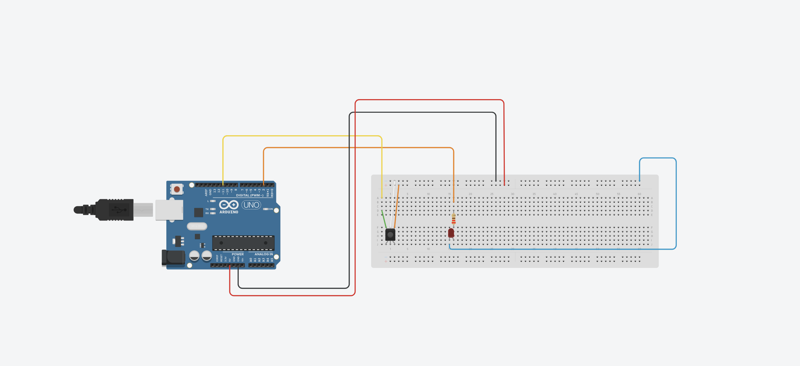
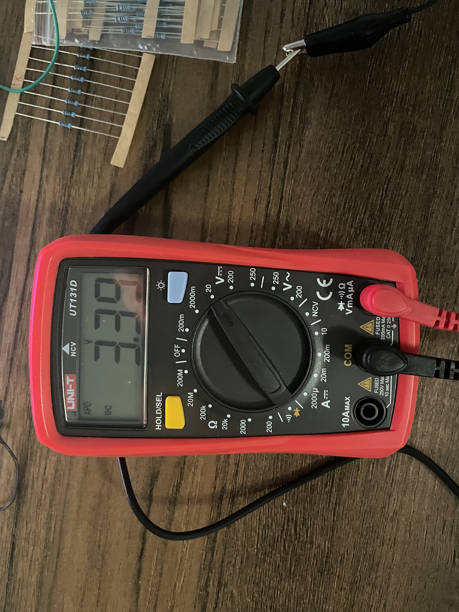
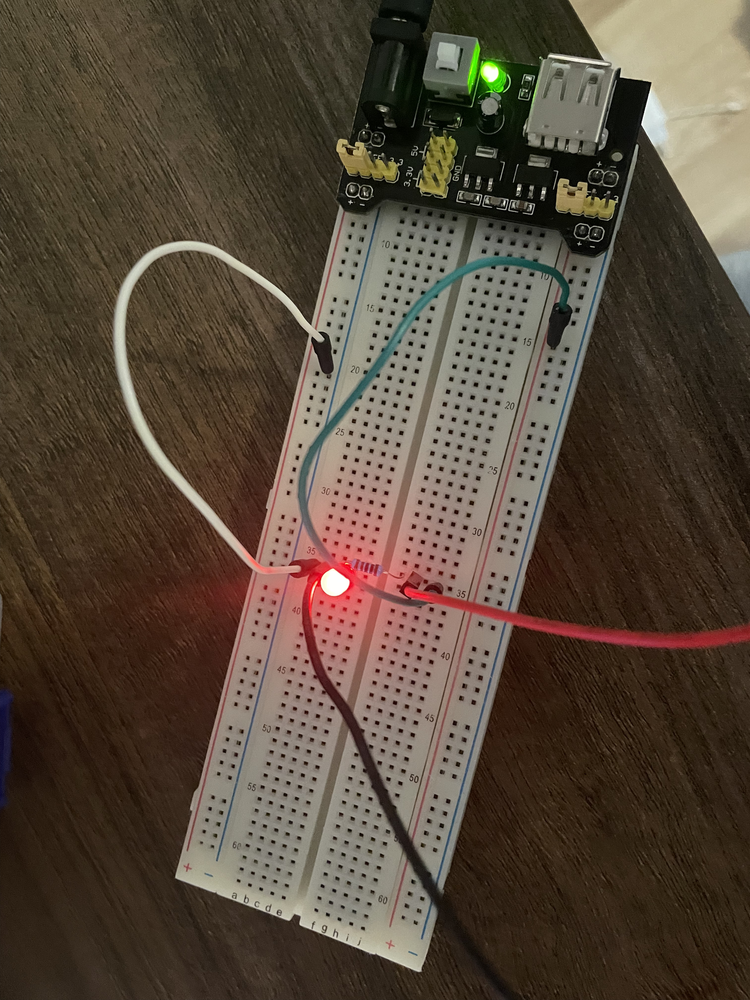

# LED Project

Seeing how having leds in your room has become a whole trend, I decided to hop on, but do it [my way](https://www.youtube.com/watch?v=qQzdAsjWGPg). So I started working on my own led strip, done with an Arduino microcontroller and controlled with a IR remote.

## DIY

### Components

1x Arduino UNO R3
1x NeoPixel WS2812B strip
2x 1k Ohm Resistors (actually you can use any resistors as long their equivalent resistance will be ~480 Ohms in the end)
1x TSOP38238 IR Receiver
1x IR Remote (I don't know my model as I received it with a kit)
10x jump wires (I like using more wires for modularity, but you can get away with less)

### Schematics 

### Story

You will read about how my leds couldn't be powered fully using the standard Arduino usb cable. This is a mistake, and as long as you won't use all the leds or very consuming (in regards to current) colors this shouldn't be a problem. My problem was not knowing how many leds I actually have (it wrote 144 on the wheel the leds came on, but there were actually more, so of course that not the whole strip was powered when my code was limiting the power to only 144 leds...) Anyways, I discovered this while doing the final adjustments on my code so I tought I should add it here.

I started by figuring out how the leds work. I used a Neopixel WS2812B with 144 leds for this project. Any other Neopixel ws2812B strip should be similar, but of course your current needs will be different, and also your code will need a little tweaking for changing the no. leds that it must control. 

[Here is the datasheet for the neopixel](https://d2j2m4p6r3pg95.cloudfront.net/module_files/led-cube/assets/datasheets/WS2812B.pdf), and [here is a guide of how to use them given out by their producer](https://components101.com/sites/default/files/component_datasheet/NeoPixel%20LEDs%20Datasheet.pdf). The key points that interest us from here are:

* the strip is working at 5V, and supports up to 5.5V
* each led should use 60mA at full brightness and with RGB set on (255, 255, 255). Basically, each color at full brightness needs 20mA.
* the wiring is pretty simple. One only needs to use the JST connector, and the colors are pretty self-explanatory, but anyways:  
* it's recommended that one uses a resistance of 450-500 Ohms on the data line for protection reasons
* a 1000uF capacitor connected in paralel is also recommended, especially if you are using a source

With all this knowledge I started on tinkering a very basic circuit, with the leds connected directly to the UNO R3 and also powered by it. The code used for testing them was a generic test found in the Adafruit guide and can be found [here](./src/basics/basic_test/basic_test.ino)

I only showed one color at around 25% brightness, so I expected my leds to need around 5mA / led. In reality when I set my code to light up all my 144 leds in red / green / blue it only managed to light half of them, so this means that they needed around 7 mA / led.(based on the fact that Arduino provides around 500 mA through its 5V pin.) The brightness was good for me and I wouldn't expect to go further than 50%. So this means that each led shoul need a max of 30 mA, and the whole strip shouldn't need more than 4,5 mA. But even this is a pretty extreme case, so I think that for our needs anything between 2-3 A would be a good source.

Now that I know how my leds work and how much power they need, I can move to the IR receiver, which will help me control them from a remote. I bought a TSOP38238. From it's [datasheet](https://www.sparkfun.com/datasheets/Sensors/Infrared/tsop382.pdf) we extract the following important characteristics: 

* it requires 2.5 - 5.5 V
* it needs 350µA (so basically negligible)
* signal frequency: 38kHz
* detection up to 45m (I will never use it for more than a couple meters, so I don't really care about this) 

The wiring is shown here: . I tested this receiver with the most basic code one can write with the IRremote library. You can find it here: [here](./src/basics/basic_ir_test/basic_ir_test.ino). I also connected a small red led for which the "CH" button acts as a switch.   

I am using IRremote.h as a library to control my receiver. If you want to understand the library better take a look [here](https://github.com/Arduino-IRremote/Arduino-IRremote/tree/master/src).

Ok, now we know for sure that we have the wiring under control and that we know how much current we need (2.5 A for the led strip, 350 uA for the IR receiver and around 500 mA for the Arduino). This means that 3A should be enough. So I got myself a 5V 3A wall adapter, ideal for the leds that I plan on using in my room.

As always, I tested the adapter to make sure it gives what it promises.   Now, why are there 3.3V(3.3ish) instead of 5V as it should be? Apparently my power supply needs 7-9V and not 5V as I remembered it to be.(well I guess that's what you get for tinkering seldomly) Also, it's output is a max of 700mA which is not any better than the lousy UNO gives.

I could search up for a new power supply, and for a new charger for that matter, but honestly I don't have the patience to wait so long (because the pandemic I can't pick up things directly and can only order) so I'm just gonna stick with 500mA which should be enough to power the whole strip if I light only half of them. Also, this means the max brightness will remain 25%. 

So I started decoding what all the codes for my buttons are, by using the code provided in ./basics/. Using it I also saw what protocol is the remote using, so I can ignore any other protocol. So I began writting the actual code, by first creating a switch case that would react to every button. Now it's time to also wire the led strip and start making the magic!

Here are two pictures of the wiring I used:

I won't go in detail with the code as I believe the two libraries I used are quite well documented (and with self-explanatory function names) and my code is explained in comments.

And that's the end of the journey! If you take a look at the code you'll see that I also added 2 holiday effects.

## Usage

* CH - -> dims the brightness
* CH + -> increases the brightness
* CH   -> starts the leds and stops them
* PREV -> sets how many leds will be on at a given time (see code comments for more details)
* ZERO -> sets leds to color red
* ONEH -> sets leds to color green
* TWOH -> sets leds to color blue
* ONE  -> sets rainbow mode on
* TWO  -> sets christmas effect 1
* THREE-> sets christmas effect 2
